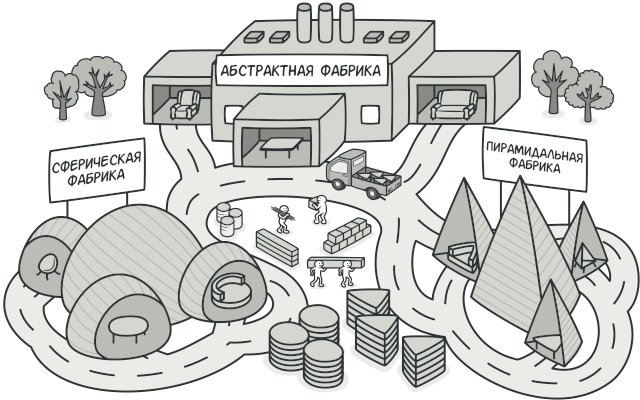
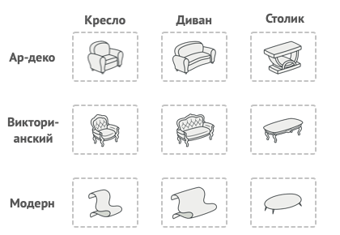
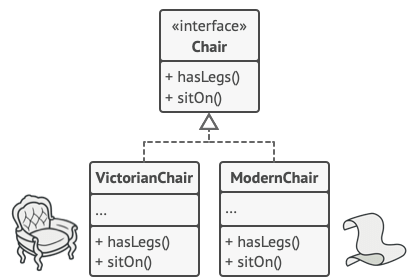
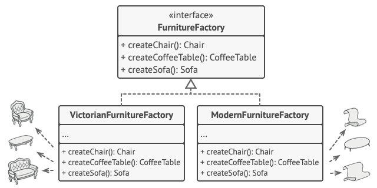
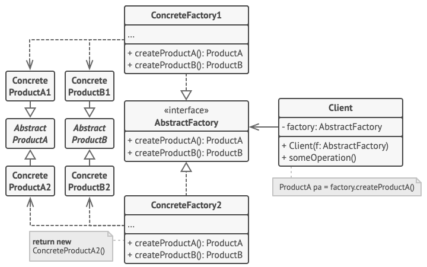

# Абстрактная фабрика
Также известен как: Abstract Factory

## Источник
[Refactoring GURU: Абстрактная фабрика](https://refactoring.guru/ru/design-patterns/abstract-factory)

## Суть паттерна

**Абстрактная фабрика** — это порождающий паттерн проектирования, который позволяет создавать семейства связанных объектов, не привязываясь к конкретным классам создаваемых объектов.

## Проблема

Представьте, что вы пишете симулятор мебельного магазина. Ваш код содержит:
1. Семейство зависимых продуктов. Скажем, *Кресло* + *Диван* + *Столик*.
2. Несколько вариаций этого семейства. Например, продукты *Кресло*, *Диван* и *Столик* представлены в трёх разных стилях: *Ар-деко*, *Викторианском* и *Модерне*.

Таблица соответствия семейства продуктам к их вариациям

Вам нужен такой способ создавать объекты продуктов, чтобы они сочетались с другими продуктами того же семейства. Это важно, так как клиенты расстраиваются, если получают несочетающуюся мебель.

Кроме того, вы не хотите вносить изменения в существующий код при добавлении новых продуктов или семейcтв в программу. Поставщики часто обновляют свои каталоги, и вы бы не хотели менять уже написанный код каждый раз при получении новых моделей мебели.

## Решение

Для начала паттерн Абстрактная фабрика предлагает выделить общие интерфейсы для отдельных продуктов, составляющих семейства. Так, все вариации кресел получат общий интерфейс *Кресло*, все диваны реализуют интерфейс *Диван* и так 

Далее вы создаёте *абстрактную фабрику* — общий интерфейс, который содержит методы создания всех продуктов семейства (например, *создатьКресло*, *создатьДиван* и *создатьСтолик*). Эти операции должны возвращать абстрактные типы продуктов, представленные интерфейсами, которые мы выделили ранее — *Кресла*, *Диваны* и *Столики*.

Клиентский код должен работать как с фабриками, так и с продуктами только через их общие интерфейсы. Это позволит подавать в ваши классы любой тип фабрики и производить любые продукты, ничего не ломая.

Например, клиентский код просит фабрику сделать стул. Он не знает, какого типа была эта фабрика. Он не знает, получит викторианский или модерновый стул. Для него важно, чтобы на стуле можно было сидеть и чтобы этот стул отлично смотрелся с диваном той же фабрики.

Осталось прояснить последний момент: кто создаёт объекты конкретных фабрик, если клиентский код работает только с интерфейсами фабрик? Обычно программа создаёт конкретный объект фабрики при запуске, причём тип фабрики выбирается, исходя из параметров окружения или конфигурации.

## Структура

1. **Абстрактные продукты** объявляют интерфейсы продуктов, которые связаны друг с другом по смыслу, но выполняют разные функции.
2. **Конкретные продукты** — большой набор классов, которые относятся к различным абстрактным продуктам (кресло/столик), но имеют одни и те же вариации (Викторианский/Модерн).
3. **Абстрактная фабрика** объявляет методы создания различных абстрактных продуктов (кресло/столик).
4. **Конкретные фабрики** относятся каждая к своей вариации продуктов (Викторианский/Модерн) и реализуют методы абстрактной фабрики, позволяя создавать все продукты определённой вариации.
5. Несмотря на то, что конкретные фабрики порождают конкретные продукты, сигнатуры их методов должны возвращать соответствующие абстрактные продукты. Это позволит клиентскому коду, использующему фабрику, не привязываться к конкретным классам продуктов. Клиент сможет работать с любыми вариациями продуктов через абстрактные интерфейсы.

## Применимость

* Когда бизнес-логика программы должна работать с разными видами связанных друг с другом продуктов, не завися от конкретных классов продуктов.

    >Абстрактная фабрика скрывает от клиентского кода подробности того, как и какие конкретно объекты будут созданы. Но при этом клиентский код может работать со всеми типами создаваемых продуктов, поскольку их общий интерфейс был заранее определён.

* Когда в программе уже используется Фабричный метод, но очередные изменения предполагают введение новых типов продуктов.

    >В хорошей программе каждый класс отвечает только за одну вещь. Если класс имеет слишком много фабричных методов, они способны затуманить его основную функцию. Поэтому имеет смысл вынести всю логику создания продуктов в отдельную иерархию классов, применив абстрактную фабрику.

## Шаги реализации

1. Создайте таблицу соотношений типов продуктов к вариациям семейств продуктов. 
2. Сведите все вариации продуктов к общим интерфейсам.
3. Определите интерфейс абстрактной фабрики. Он должен иметь фабричные методы для создания каждого из типов продуктов.
4. Создайте классы конкретных фабрик, реализовав интерфейс абстрактной фабрики. Этих классов должно быть столько же, сколько и вариаций семейств продуктов.
5. Измените код инициализации программы так, чтобы она создавала определённую фабрику и передавала её в клиентский код.
6. Замените в клиентском коде участки создания продуктов через конструктор вызовами соответствующих методов фабрики.

## Преимущества и недостатки

<table>
  <thead>
    <tr>
      <th>Преимущества</th>
      <th>Недостатки</th>
    </tr>
  </thead>
  <tbody >
    <tr>
      <td>Гарантирует сочетаемость создаваемых продуктов.</td>
      <td>Усложняет код программы из-за введения множества дополнительных классов.</td>
    </tr>
    <tr>
      <td>Избавляет клиентский код от привязки к конкретным классам продуктов.</td>
      <td rowspan="4">Требует наличия всех типов продуктов в каждой вариации.</td>
    </tr>
    <tr>
      <td>Выделяет код производства продуктов в одно место, упрощая поддержку кода.</td>
    </tr>
    <tr>
      <td>Упрощает добавление новых продуктов в программу.</td>
    </tr>
    <tr>
      <td>Реализует <i>принцип открытости/закрытости</i>.</td>
    </tr>
  </tbody>
</table>

## Запуск примера

### Сборка

    * mvn clean package

### MacOSFactory

    * java -Dfile.encoding=UTF-8 -classpath target/classes ru.koylubaevnt.patterns.creational.abstractfactory.Demo

### WindowsOSFactory

    * java -Dfile.encoding=UTF-8 -classpath target/classes ru.koylubaevnt.patterns.creational.abstractfactory.Demo 1
