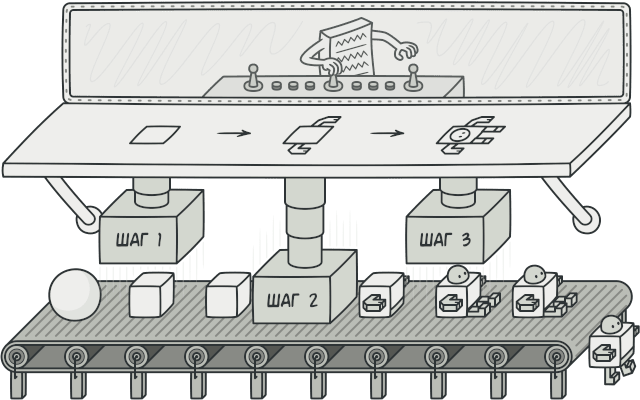
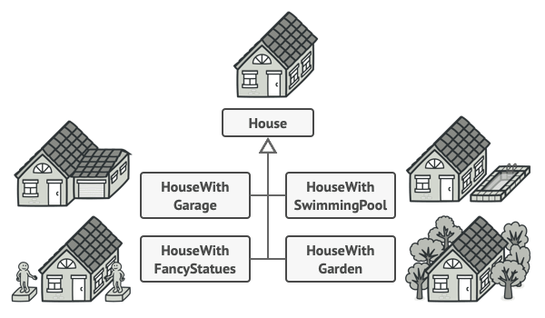
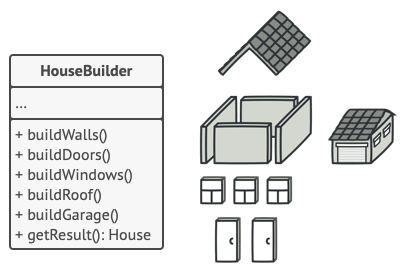
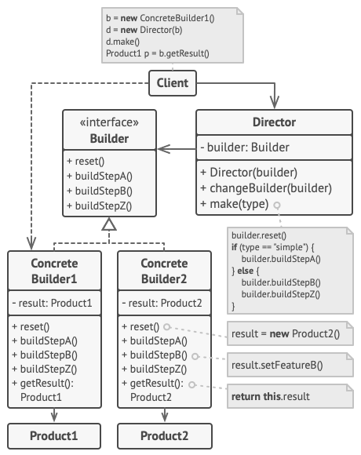

# Строитель
Также известен как: Builder

## Источник
[Refactoring GURU: Абстрактная фабрика](https://refactoring.guru/ru/design-patterns/builder)

## Суть паттерна

**Строитель** — это порождающий паттерн проектирования, который позволяет создавать сложные объекты пошагово. Строитель даёт возможность использовать один и тот же код строительства для получения разных представлений объектов.

## Проблема

Представьте сложный объект, требующий кропотливой пошаговой инициализации множества полей и вложенных объектов. Код инициализации таких объектов обычно спрятан внутри монструозного конструктора с десятком параметров. Либо ещё хуже — распылён по всему клиентскому коду.

Например, давайте подумаем о том, как создать объект *Дом*. Чтобы построить стандартный дом, нужно поставить 4 стены, установить двери, вставить пару окон и положить крышу. Но что, если вы хотите дом побольше да посветлее, имеющий сад, бассейн и прочее добро?

Самое простое решение — расширить класс *Дом*, создав подклассы для всех комбинаций параметров дома. Проблема такого подхода — это громадное количество классов, которые вам придётся создать. Каждый новый параметр, вроде цвета обоев или материала кровли, заставит вас создавать всё больше и больше классов для перечисления всех возможных вариантов.

Чтобы не плодить подклассы, вы можете подойти к решению с другой стороны. Вы можете создать гигантский конструктор *Дома*, принимающий уйму параметров для контроля над создаваемым продуктом. Действительно, это избавит вас от подклассов, но приведёт к другой проблеме.

Большая часть этих параметров будет простаивать, а вызовы конструктора будут выглядеть монструозно из-за длинного списка параметров. К примеру, далеко не каждый дом имеет бассейн, поэтому параметры, связанные с бассейнами, будут простаивать бесполезно в 99% случаев.

## Решение

Паттерн Строитель предлагает вынести конструирование объекта за пределы его собственного класса, поручив это дело отдельным объектам, называемым строителями.

Паттерн предлагает разбить процесс конструирования объекта на отдельные шаги (например, *построитьСтены*, *вставитьДвери* и другие). Чтобы создать объект, вам нужно поочерёдно вызывать методы строителя. Причём не нужно запускать все шаги, а только те, что нужны для производства объекта определённой конфигурации.

Зачастую один и тот же шаг строительства может отличаться для разных вариаций производимых объектов. Например, деревянный дом потребует строительства стен из дерева, а каменный — из камня.

В этом случае вы можете создать несколько классов строителей, выполняющих одни и те же шаги по-разному. Используя этих строителей в одном и том же строительном процессе, вы сможете получать на выходе различные объекты.

Например, один строитель делает стены из дерева и стекла, другой из камня и железа, третий из золота и бриллиантов. Вызвав одни и те же шаги строительства, в первом случае вы получите обычный жилой дом, во втором — маленькую крепость, а в третьем — роскошное жилище. Замечу, что код, который вызывает шаги строительства, должен работать со строителями через общий интерфейс, чтобы их можно было свободно взаимозаменять.

### Директор

Вы можете пойти дальше и выделить вызовы методов строителя в отдельный класс, называемый *директором*. В этом случае директор будет задавать порядок шагов строительства, а строитель — выполнять их.

Отдельный класс директора не является строго обязательным. Вы можете вызывать методы строителя и напрямую из клиентского кода. Тем не менее, директор полезен, если у вас есть несколько способов конструирования продуктов, отличающихся порядком и наличием шагов конструирования. В этом случае вы сможете объединить всю эту логику в одном классе.

Такая структура классов полностью скроет от клиентского кода процесс конструирования объектов. Клиенту останется только привязать желаемого строителя к директору, а затем получить у строителя готовый результат.

## Структура

1. **Интерфейс строителя** объявляет шаги конструирования продуктов, общие для всех видов строителе
2. **Конкретные строители** реализуют строительные шаги, каждый по-своему. Конкретные строители могут производить разнородные объекты, не имеющие общего интерфейса.
3. **Продукт** — создаваемый объект. Продукты, сделанные разными строителями, не обязаны иметь общий интерфейс.
4. **Директор** определяет порядок вызова строительных шагов для производства той или иной конфигурации продуктов.
5. Обычно **Клиент** подаёт в конструктор директора уже готовый объект-строитель, и в дальнейшем данный директор использует только его. Но возможен и другой вариант, когда клиент передаёт строителя через параметр строительного метода директора. В этом случае можно каждый раз применять разных строителей для производства различных представлений объектов.

## Применимость

* Когда вы хотите избавиться от «телескопического конструктора».
  > Допустим, у вас есть один конструктор с десятью опциональными параметрами. Его неудобно вызывать, поэтому вы создали ещё десять конструкторов с меньшим количеством параметров. Всё, что они делают — это переадресуют вызов к базовому конструктору, подавая какие-то значения по умолчанию в параметры, которые пропущены в них самих.

  > class Pizza { 
  > &nbsp;&nbsp;&nbsp;&nbsp;Pizza(int size) { ... } 
  > &nbsp;&nbsp;&nbsp;&nbsp;Pizza(int size, boolean cheese) { ... } 
  > &nbsp;&nbsp;&nbsp;&nbsp;Pizza(int size, boolean cheese, boolean pepperoni) { ... } 
  > &nbsp;&nbsp;&nbsp;&nbsp;// ...

  > Такого монстра можно создать только в языках, имеющих механизм перегрузки методов, например, C# или Java.

  > Паттерн Строитель позволяет собирать объекты пошагово, вызывая только те шаги, которые вам нужны. А значит, больше не нужно пытаться «запихнуть» в конструктор все возможные опции продукта.

* Когда ваш код должен создавать разные представления какого-то объекта. Например, деревянные и железобетонные дома.
  > Строитель можно применить, если создание нескольких представлений объекта состоит из одинаковых этапов, которые отличаются в деталях.

  > Интерфейс строителей определит все возможные этапы конструирования. Каждому представлению будет соответствовать собственный класс-строитель. А порядок этапов строительства будет задавать класс-директор.

* Когда вам нужно собирать сложные составные объекты, например, деревья Компоновщика.
  > Строитель конструирует объекты пошагово, а не за один проход. Более того, шаги строительства можно выполнять рекурсивно. А без этого не построить древовидную структуру, вроде Компоновщика.

  > Заметьте, что Строитель не позволяет посторонним объектам иметь доступ к конструируемому объекту, пока тот не будет полностью готов. Это предохраняет клиентский код от получения незаконченных «битых» объектов.

## Шаги реализации

1. Убедитесь в том, что создание разных представлений объекта можно свести к общим шагам.
2. Опишите эти шаги в общем интерфейсе строителей.
3. Для каждого из представлений объекта-продукта создайте по одному классу-строителю и реализуйте их методы строительства.  
Не забудьте про метод получения результата. Обычно конкретные строители определяют собственные методы получения результата строительства. Вы не можете описать эти методы в интерфейсе строителей, поскольку продукты не обязательно должны иметь общий базовый класс или интерфейс. Но вы всегда сможете добавить метод получения результата в общий интерфейс, если ваши строители производят однородные продукты с общим предком.
4. Подумайте о создании класса директора. Его методы будут создавать различные конфигурации продуктов, вызывая разные шаги одного и того же строителя.
5. Клиентский код должен будет создавать и объекты строителей, и объект директора. Перед началом строительства клиент должен связать определённого строителя с директором. Это можно сделать либо через конструктор, либо через сеттер, либо подав строителя напрямую в строительный метод директора.
6. Результат строительства можно вернуть из директора, но только если метод возврата продукта удалось поместить в общий интерфейс строителей. Иначе вы жёстко привяжете директора к конкретным классам строителей.

## Преимущества и недостатки

<table>
  <thead>
    <tr>
      <th>Преимущества</th>
      <th>Недостатки</th>
    </tr>
  </thead>
  <tbody >
    <tr>
      <td>Позволяет создавать продукты пошагово.</td>
      <td>Усложняет код программы из-за введения дополнительных классов.</td>
    </tr>
    <tr>
      <td>Позволяет использовать один и тот же код для создания различных продуктов.</td>
      <td rowspan="2">Клиент будет привязан к конкретным классам строителей, так как в интерфейсе директора может не быть метода получения результата.</td>
    </tr>
    <tr>
      <td>Изолирует сложный код сборки продукта от его основной бизнес-логики.</td>
    </tr>
  </tbody>
</table>

## Запуск примера

### Сборка

    * mvn clean package

### Запуск

    * java -Dfile.encoding=UTF-8 -classpath target/classes ru.koylubaevnt.patterns.creational.builder.Demo
