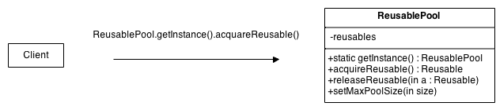

# Объектный пул
Также известен как: Object Pool

## Источник
[Source Making: Объектный пул](https://sourcemaking.com/design_patterns/object_pool)

## Суть паттерна

**Объектный пул** — порождающий шаблон проектирования, набор инициализированных и готовых к использованию объектов. Когда системе требуется объект, он не создаётся, а берётся из пула. Когда объект больше не нужен, он не уничтожается, а возвращается в пул.

## Проблема

Пулы объектов (известны также как пулы ресурсов) используются для управления кэшированием объектов. Клиент, имеющий доступ к пулу объектов может избежать создания новых объектов, просто запрашивая в пуле уже созданный экземпляр. Пул объектов может быть растущим, когда при отсутствии свободных создаются новые объекты или c ограничением количества создаваемых объектов.

Желательно, чтобы все многократно используемые объекты, свободные в некоторый момент времени, хранились в одном и том же пуле объектов. Тогда ими можно управлять на основе единой политики. Для этого класс Объектный пул проектируется с помощью паттерна Одиночка.

## Структура

1. **Reusable** - экземпляры классов в этой роли взаимодействуют с другими объектами в течение ограниченного времени, а затем они больше не нужны для этого взаимодействия.
2. **Client** - экземпляры классов в этой роли используют объекты Reusable.
3. **ReusablePool** - экземпляры классов в этой роли управляют объектами Reusable для использования объектами Client.

## Применимость

1. Объектный пул применяется для повышения производительности, когда создание объекта в начале работы и уничтожение его в конце приводит к большим затратам. Особенно заметно повышение производительности, когда объекты часто создаются-уничтожаются, но одновременно существует лишь небольшое их число.
2. Объектный пул удобен, если объект владеет другими ресурсами, кроме памяти — например, сетевыми сокетами. Либо если коллекция объектов отнимает значительную часть памяти компьютера и «мусора» создаётся действительно много.

## Шаги реализации
 
1. Создайте класс ObjectPool с private массивом объектов внутри.
2. Создайте acquire и release методы в классе ObjectPool.
3. Убедитесь, что ваш ObjectPool является одиночкой.

## Ловушки

1. После того, как объект возвращён, он должен вернуться в состояние, пригодное для дальнейшего использования. Если объекты после возвращения в пул оказываются в неправильном или неопределённом состоянии, такая конструкция называется объектной клоакой (англ. object cesspool).
2. Повторное использование объектов также может привести к утечке информации. Если в объекте есть секретные данные (например, номер кредитной карты), после освобождения объекта эту информацию надо затереть.
3. Многопоточный объектный пул написать не так просто.
4. На 2020-е годы в языках со сбором мусора управление памятью хорошо оптимизировано под постоянное выделение-отдачу. Так что, если объект занимает только память, руководства по Java не рекомендуют пользоваться пулами: обычный new требует всего десять процессорных команд. А сборщики мусора часто сканируют ссылки на объекты, а не их память — потому чем больше в памяти «живых» объектов, тем ниже производительность такого сборщика.

## Запуск примера

### Сборка

    * mvn clean package

### Запуск

    * java -Dfile.encoding=UTF-8 -classpath target/classes ru.koylubaevnt.patterns.creational.prototype.Demo
