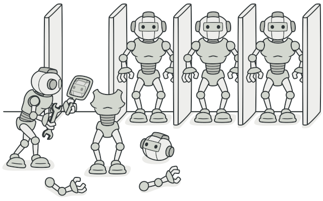
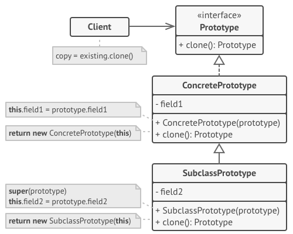
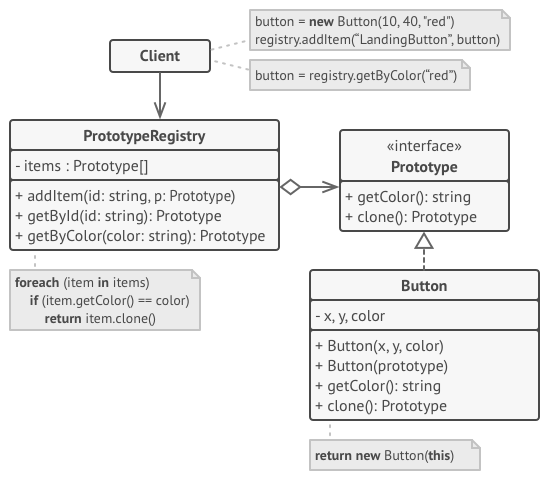

# Прототип
Также известен как: Клон, Prototype 

## Источник
[Refactoring GURU: Прототип](https://refactoring.guru/ru/design-patterns/prototype)

## Суть паттерна

**Прототип** — это порождающий паттерн проектирования, который позволяет копировать объекты, не вдаваясь в подробности их реализации.

## Проблема

У вас есть объект, который нужно скопировать. Как это сделать? Нужно создать пустой объект такого же класса, а затем поочерёдно скопировать значения всех полей из старого объекта в новый.

Прекрасно! Но есть нюанс. Не каждый объект удастся скопировать таким образом, ведь часть его состояния может быть приватной, а значит — недоступной для остального кода программы.

Но есть и другая проблема. Копирующий код станет зависим от классов копируемых объектов. Ведь, чтобы перебрать все поля объекта, нужно привязаться к его классу. Из-за этого вы не сможете копировать объекты, зная только их интерфейсы, а не конкретные классы.

## Решение

Паттерн Прототип поручает создание копий самим копируемым объектам. Он вводит общий интерфейс для всех объектов, поддерживающих клонирование. Это позволяет копировать объекты, не привязываясь к их конкретным классам. Обычно такой интерфейс имеет всего один метод clone.

Реализация этого метода в разных классах очень схожа. Метод создаёт новый объект текущего класса и копирует в него значения всех полей собственного объекта. Так получится скопировать даже приватные поля, так как большинство языков программирования разрешает доступ к приватным полям любого объекта текущего класса.

Объект, который копируют, называется прототипом (откуда и название паттерна). Когда объекты программы содержат сотни полей и тысячи возможных конфигураций, прототипы могут служить своеобразной альтернативой созданию подклассов.

В этом случае все возможные прототипы заготавливаются и настраиваются на этапе инициализации программы. Потом, когда программе нужен новый объект, она создаёт копию из приготовленного прототипа.

## Структура

### Базовая реализация

1. **Интерфейс прототипов** описывает операции клонирования. В большинстве случаев — это единственный метод *clone*.
2. **Конкретный прототип** реализует операцию клонирования самого себя. Помимо банального копирования значений всех полей, здесь могут быть спрятаны различные сложности, о которых не нужно знать клиенту. Например, клонирование связанных объектов, распутывание рекурсивных зависимостей и прочее.
3. **Клиент** создаёт копию объекта, обращаясь к нему через общий интерфейс прототипов.

### Реализация с общим хранилищем прототипов

**Хранилище прототипов** облегчает доступ к часто используемым прототипам, храня набор предварительно созданных эталонных, готовых к копированию объектов. Простейшее хранилище может быть построено с помощью хеш-таблицы вида *имя-прототипа* → *прототип*. Но для удобства поиска прототипы можно маркировать и другими критериями, а не только условным именем.

## Применимость

* Когда ваш код не должен зависеть от классов копируемых объектов.
> Такое часто бывает, если ваш код работает с объектами, поданными извне через какой-то общий интерфейс. Вы не можете привязаться к их классам, даже если бы хотели, поскольку их конкретные классы неизвестны.
> Паттерн прототип предоставляет клиенту общий интерфейс для работы со всеми прототипами. Клиенту не нужно зависеть от всех классов копируемых объектов, а только от интерфейса клонирования.

* Когда вы имеете уйму подклассов, которые отличаются начальными значениями полей. Кто-то мог создать все эти классы, чтобы иметь возможность легко порождать объекты с определённой конфигурацией.
> Паттерн прототип предлагает использовать набор прототипов, вместо создания подклассов для описания популярных конфигураций объектов.
> Таким образом, вместо порождения объектов из подклассов, вы будете копировать существующие объекты-прототипы, в которых уже настроено внутреннее состояние. Это позволит избежать взрывного роста количества классов в программе и уменьшить её сложность.

## Шаги реализации

1. Создайте интерфейс прототипов с единственным методом clone. Если у вас уже есть иерархия продуктов, метод клонирования можно объявить непосредственно в каждом из её классов.
2. Добавьте в классы будущих прототипов альтернативный конструктор, принимающий в качестве аргумента объект текущего класса. Этот конструктор должен скопировать из поданного объекта значения всех полей, объявленных в рамках текущего класса, а затем передать выполнение родительскому конструктору, чтобы тот позаботился о полях, объявленных в суперклассе.

Если ваш язык программирования не поддерживает перегрузку методов, то вам не удастся создать несколько версий конструктора. В этом случае копирование значений можно проводить и в другом методе, специально созданном для этих целей. Конструктор удобнее тем, что позволяет клонировать объект за один вызов.
3. Метод клонирования обычно состоит всего из одной строки: вызова оператора new с конструктором прототипа. Все классы, поддерживающие клонирование, должны явно определить метод clone, чтобы использовать собственный класс с оператором new. В обратном случае результатом клонирования станет объект родительского класса.

4. Опционально, создайте центральное хранилище прототипов. В нём удобно хранить вариации объектов, возможно, даже одного класса, но по-разному настроенных.

Вы можете разместить это хранилище либо в новом фабричном классе, либо в фабричном методе базового класса прототипов. Такой фабричный метод должен на основании входящих аргументов искать в хранилище прототипов подходящий экземпляр, а затем вызывать его метод клонирования и возвращать полученный объект.

Наконец, нужно избавиться от прямых вызовов конструкторов объектов, заменив их вызовами фабричного метода хранилища прототипов.

## Преимущества и недостатки

<table>
  <thead>
    <tr>
      <th>Преимущества</th>
      <th>Недостатки</th>
    </tr>
  </thead>
  <tbody >
    <tr>
      <td>Позволяет клонировать объекты, не привязываясь к их конкретным классам.</td>
      <td rowspan="4"> Сложно клонировать составные объекты, имеющие ссылки на другие объекты.</td>
    </tr>
    <tr>
      <td>Меньше повторяющегося кода инициализации объектов.</td>
    </tr>
    <tr>
      <td>Ускоряет создание объектов.</td>
    </tr>
    <tr>
      <td>Альтернатива созданию подклассов для конструирования сложных объектов.</td>
    </tr>
  </tbody>
</table>

## Запуск примера

### Сборка

    * mvn clean package

### Запуск

    * java -Dfile.encoding=UTF-8 -classpath target/classes ru.koylubaevnt.patterns.creational.prototype.Demo
