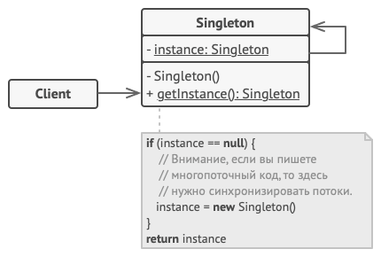

# Одиночка
Также известен как: Singleton

## Источник
[Refactoring GURU: Одиночка](https://refactoring.guru/ru/design-patterns/singleton)

## Суть паттерна

**Одиночка** — это порождающий паттерн проектирования, который гарантирует, что у класса есть только один экземпляр, и предоставляет к нему глобальную точку доступа.

## Проблема

Одиночка решает сразу две проблемы, нарушая *принцип единственной ответственности класса*.

1. **Гарантирует наличие единственного экземпляра класса**. Чаще всего это полезно для доступа к какому-то общему ресурсу, например, базе данных.

Представьте, что вы создали объект, а через некоторое время пробуете создать ещё один. В этом случае хотелось бы получить старый объект, вместо создания нового.

Такое поведение невозможно реализовать с помощью обычного конструктора, так как конструктор класса всегда возвращает новый объект.
2. **Предоставляет глобальную точку доступа**. Это не просто глобальная переменная, через которую можно достучаться к определённому объекту. Глобальные переменные не защищены от записи, поэтому любой код может подменять их значения без вашего ведома.

Но есть и другой нюанс. Неплохо бы хранить в одном месте и код, который решает проблему №1, а также иметь к нему простой и доступный интерфейс.

Интересно, что в наше время паттерн стал настолько известен, что теперь люди называют «одиночками» даже те классы, которые решают лишь одну из проблем, перечисленных выше.

## Решение

Все реализации одиночки сводятся к тому, чтобы скрыть конструктор по умолчанию и создать публичный статический метод, который и будет контролировать жизненный цикл объекта-одиночки.

Если у вас есть доступ к классу одиночки, значит, будет доступ и к этому статическому методу. Из какой точки кода вы бы его ни вызвали, он всегда будет отдавать один и тот же объект.

## Структура

Одиночка определяет статический метод *getInstance*, который возвращает единственный экземпляр своего класса.

Конструктор одиночки должен быть скрыт от клиентов. Вызов метода *getInstance* должен стать единственным способом получить объект этого класса.

## Применимость

* **Когда в программе должен быть единственный экземпляр какого-то класса, доступный всем клиентам (например, общий доступ к базе данных из разных частей программы).**

Одиночка скрывает от клиентов все способы создания нового объекта, кроме специального метода. Этот метод либо создаёт объект, либо отдаёт существующий объект, если он уже был создан.

* **Когда вам хочется иметь больше контроля над глобальными переменными.**

В отличие от глобальных переменных, Одиночка гарантирует, что никакой другой код не заменит созданный экземпляр класса, поэтому вы всегда уверены в наличии лишь одного объекта-одиночки.

Тем не менее, в любой момент вы можете расширить это ограничение и позволить любое количество объектов-одиночек, поменяв код в одном месте (метод getInstance).

## Шаги реализации

1. Добавьте в класс приватное статическое поле, которое будет содержать одиночный объект.
2. Объявите статический создающий метод, который будет использоваться для получения одиночки.
3. Добавьте «ленивую инициализацию» (создание объекта при первом вызове метода) в создающий метод одиночки.
4. Сделайте конструктор класса приватным.
5. В клиентском коде замените вызовы конструктора одиночка вызовами его создающего метода.

## Преимущества и недостатки

<table>
  <thead>
    <tr>
      <th>Преимущества</th>
      <th>Недостатки</th>
    </tr>
  </thead>
  <tbody >
    <tr>
      <td>Гарантирует наличие единственного экземпляра класса.</td>
      <td>Нарушает <i>принцип единственной ответственности класса</i>.</td>
    </tr>
    <tr>
      <td>Предоставляет к нему глобальную точку доступа.</td>
      <td>Маскирует плохой дизайн.</td>
    </tr>
    <tr>
      <td rowspan="2">Реализует отложенную инициализацию объекта-одиночки.</td>
      <td>Проблемы мультипоточности.</td>
    </tr>
    <tr>
      <td> Требует постоянного создания Mock-объектов при юнит-тестировании.</td>
    </tr>
  </tbody>
</table>

## Запуск примера

### Сборка

    * mvn clean package

### Запуск

#### Наивный Одиночка

    * java -Dfile.encoding=UTF-8 -classpath target/classes ru.koylubaevnt.patterns.creational.singleton.DemoSingleThread

#### Наивный Одиночка (мультипоток: не работает)

    * java -Dfile.encoding=UTF-8 -classpath target/classes ru.koylubaevnt.patterns.creational.singleton.DemoBadMultiThread

#### Многопоточный Одиночка

    * java -Dfile.encoding=UTF-8 -classpath target/classes ru.koylubaevnt.patterns.creational.singleton.DemoMultiThread

