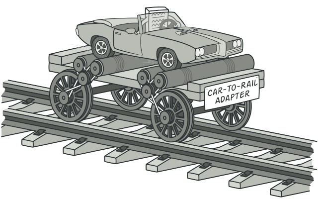
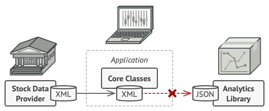
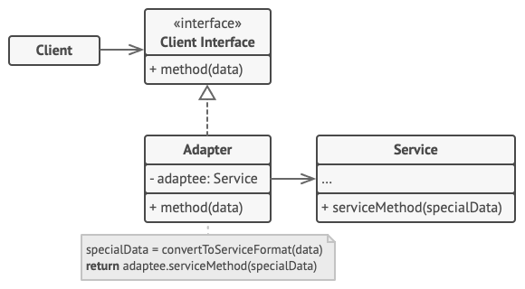
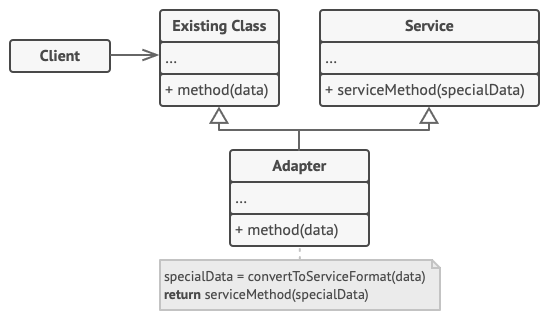

# Адаптер
Также известен как: Wrapper, Обёртка, Adapter

## Источник
[Refactoring GURU: Адаптер](https://refactoring.guru/ru/design-patterns/adapter)

## Суть паттерна

**Адаптер** — это структурный паттерн проектирования, который позволяет объектам с несовместимыми интерфейсами работать вместе.

## Проблема

Представьте, что вы делаете приложение для торговли на бирже. Ваше приложение скачивает биржевые котировки из нескольких источников в XML, а затем рисует красивые графики.

В какой-то момент вы решаете улучшить приложение, применив стороннюю библиотеку аналитики. Но вот беда — библиотека поддерживает только формат данных JSON, несовместимый с вашим приложением.

Вы смогли бы переписать библиотеку, чтобы та поддерживала формат XML. Но, во-первых, это может нарушить работу существующего кода, который уже зависит от библиотеки. А во-вторых, у вас может просто не быть доступа к её исходному коду.

## Решение

Вы можете создать *адаптер*. Это объект-переводчик, который трансформирует интерфейс или данные одного объекта в такой вид, чтобы он стал понятен другому объекту.

При этом адаптер оборачивает один из объектов, так что другой объект даже не знает о наличии первого. Например, вы можете обернуть объект, работающий в метрах, адаптером, который бы конвертировал данные в футы.

Адаптеры могут не только переводить данные из одного формата в другой, но и помогать объектам с разными интерфейсами работать сообща. Это работает так:
1. Адаптер имеет интерфейс, который совместим с одним из объектов.
2. Поэтому этот объект может свободно вызывать методы адаптера.
3. Адаптер получает эти вызовы и перенаправляет их второму объекту, но уже в том формате и последовательности, которые понятны второму объекту.
Иногда возможно создать даже *двухсторонний адаптер*, который работал бы в обе стороны.

Таким образом, в приложении биржевых котировок вы могли бы создать класс *XML_To_JSON_Adapter*, который бы оборачивал объект того или иного класса библиотеки аналитики. Ваш код посылал бы адаптеру запросы в формате XML, а адаптер сначала транслировал входящие данные в формат JSON, а затем передавал бы их методам обёрнутого объекта аналитики.

## Структура

### Адаптер объектов

Эта реализация использует агрегацию: объект адаптера «оборачивает», то есть содержит ссылку на служебный объект. Такой подход работает во всех языках программирования.

1. **Клиент** — это класс, который содержит существующую бизнес-логику программы.
2. **Клиентский интерфейс** описывает протокол, через который клиент может работать с другими классами.
3. **Сервис** — это какой-то полезный класс, обычно сторонний. Клиент не может использовать этот класс напрямую, так как сервис имеет непонятный ему интерфейс.
4. **Адаптер** — это класс, который может одновременно работать и с клиентом, и с сервисом. Он реализует клиентский интерфейс и содержит ссылку на объект сервиса. Адаптер получает вызовы от клиента через методы клиентского интерфейса, а затем переводит их в вызовы методов обёрнутого объекта в правильном формате.
5. Работая с адаптером через интерфейс, клиент не привязывается к конкретному классу адаптера. Благодаря этому, вы можете добавлять в программу новые виды адаптеров, независимо от клиентского кода. Это может пригодиться, если интерфейс сервиса вдруг изменится, например, после выхода новой версии сторонней библиотеки.

### Адаптер классов

Эта реализация базируется на наследовании: адаптер наследует оба интерфейса одновременно. Такой подход возможен только в языках, поддерживающих множественное наследование, например, C++.

1. **Адаптер классов** не нуждается во вложенном объекте, так как он может одновременно наследовать и часть существующего класса, и часть сервиса.

## Применимость

* **Когда вы хотите использовать сторонний класс, но его интерфейс не соответствует остальному коду приложения.**
    > Адаптер позволяет создать объект-прокладку, который будет превращать вызовы приложения в формат, понятный стороннему классу.

  * **Когда вам нужно использовать несколько существующих подклассов, но в них не хватает какой-то общей функциональности, причём расширить суперкласс вы не можете.**
    > Вы могли бы создать ещё один уровень подклассов и добавить в них недостающую функциональность. Но при этом придётся дублировать один и тот же код в обеих ветках подклассов.

      Более элегантным решением было бы поместить недостающую функциональность в адаптер и приспособить его для работы с суперклассом. Такой адаптер сможет работать со всеми подклассами иерархии. Это решение будет сильно напоминать паттерн *Декоратор*.

## Шаги реализации

1. Убедитесь, что у вас есть два класса с несовместимыми интерфейсами:
   * полезный сервис — служебный класс, который вы не можете изменять (он либо сторонний, либо от него зависит другой код);
   * один или несколько клиентов — существующих классов приложения, несовместимых с сервисом из-за неудобного или несовпадающего интерфейса.
2. Опишите клиентский интерфейс, через который классы приложения смогли бы использовать класс сервиса.
3. Создайте класс адаптера, реализовав этот интерфейс.
4. Поместите в адаптер поле, которое будет хранить ссылку на объект сервиса. Обычно это поле заполняют объектом, переданным в конструктор адаптера. В случае простой адаптации этот объект можно передавать через параметры методов адаптера.
5. Реализуйте все методы клиентского интерфейса в адаптере. Адаптер должен делегировать основную работу сервису.
6. Приложение должно использовать адаптер только через клиентский интерфейс. Это позволит легко изменять и добавлять адаптеры в будущем.

## Преимущества и недостатки

<table>
  <thead>
    <tr>
      <th>Преимущества</th>
      <th>Недостатки</th>
    </tr>
  </thead>
  <tbody >
    <tr>
      <td>Отделяет и скрывает от клиента подробности преобразования различных интерфейсов.</td>
      <td>Усложняет код программы из-за введения дополнительных классов.</td>
    </tr>
  </tbody>
</table>

## Запуск примера

### Сборка

    * mvn clean package

### Запуск

    * java -Dfile.encoding=UTF-8 -classpath target/classes ru.koylubaevnt.patterns.structural.adapter.Demo

