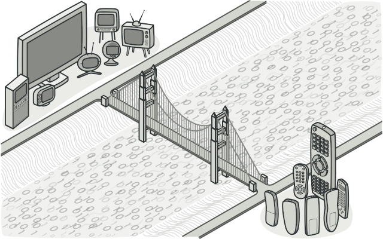
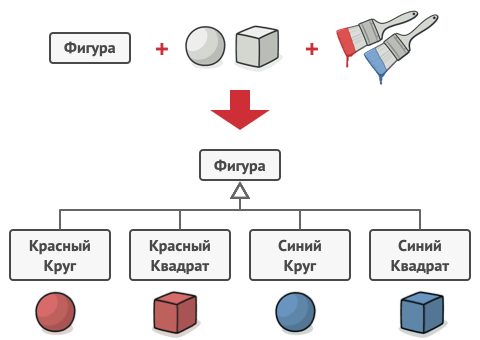
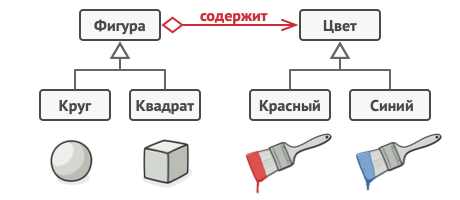
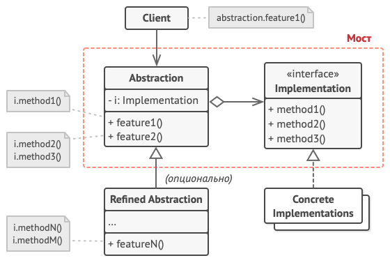

# Мост
Также известен как: Bridge

## Суть паттерна

**Мост** — это структурный паттерн проектирования, который разделяет один или несколько классов на две отдельные иерархии — абстракцию и реализацию, позволяя изменять их независимо друг от друга.

## Проблема

*Абстракция? Реализация?!* Звучит пугающе! Чтобы понять, о чём идёт речь, давайте разберём очень простой пример.

У вас есть класс геометрических *Фигур*, который имеет подклассы *Круг* и *Квадрат*. Вы хотите расширить иерархию фигур по цвету, то есть иметь *Красные* и *Синие* фигуры. Но чтобы всё это объединить, вам придётся создать 4 комбинации подклассов, вроде *СиниеКруги* и *КрасныеКвадраты*.

При добавлении новых видов фигур и цветов количество комбинаций будет расти в геометрической прогрессии. Например, чтобы ввести в программу фигуры треугольников, придётся создать сразу два новых подкласса треугольников под каждый цвет. После этого новый цвет потребует создания уже трёх классов для всех видов фигур. Чем дальше, тем хуже.

## Решение

Корень проблемы заключается в том, что мы пытаемся расширить классы фигур сразу в двух независимых плоскостях — по виду и по цвету. Именно это приводит к разрастанию дерева классов.

Паттерн Мост предлагает заменить наследование агрегацией или композицией. Для этого нужно выделить одну из таких «плоскостей» в отдельную иерархию и ссылаться на объект этой иерархии, вместо хранения его состояния и поведения внутри одного класса.

Таким образом, мы можем сделать *Цвет* отдельным классом с подклассами *Красный* и *Синий*. Класс *Фигура* получит ссылку на объект *Цвета* и сможет делегировать ему работу, если потребуется. Такая связь и станет мостом между *Фигурами* и *Цветом*. При добавлении новых классов цветов не потребуется трогать классы фигур и наоборот.

### Абстракция и Реализация

Эти термины были введены в книге GoF при описании Моста. На мой взгляд, они выглядят слишком академичными, делая описание паттерна сложнее, чем он есть на самом деле. Помня о примере с фигурами и цветами, давайте все же разберёмся, что имели в виду авторы паттерна.

Итак, абстракция (или интерфейс) — это образный слой управления чем-либо. Он не делает работу самостоятельно, а делегирует её слою реализации (иногда называемому платформой).

Если говорить о реальных программах, то абстракцией может выступать графический интерфейс программы (GUI), а реализацией — низкоуровневый код операционной системы (API), к которому графический интерфейс обращается по реакции на действия пользователя.

Вы можете развивать программу в двух разных направлениях:
* иметь несколько видов GUI (например, для простых пользователей и администраторов);
* поддерживать много видов API (например, работать под Windows, Linux и macOS).

Такая программа может выглядеть как один большой клубок кода, в котором намешаны условные операторы слоёв GUI и API.

Вы можете попытаться структурировать этот хаос, создав для каждой вариации интерфейса-платформы свои подклассы. Но такой подход приведёт к росту классов комбинаций, и с каждой новой платформой их будет всё больше.

Мы можем решить эту проблему, применив Мост. Паттерн предлагает распутать этот код, разделив его на две части:
* Абстракцию: слой графического интерфейса приложения.
* Реализацию: слой взаимодействия с операционной системой

Абстракция будет делегировать работу одному из объектов реализаций. Причём, реализации можно будет взаимозаменять, но только при условии, что все они будут следовать общему интерфейсу.

Таким образом, вы сможете изменять графический интерфейс приложения, не трогая низкоуровневый код работы с операционной системой. И наоборот, вы сможете добавлять поддержку новых операционных систем, создавая подклассы реализации, без необходимости менять классы графического интерфейса.

## Структура

1. **Абстракция** содержит управляющую логику. Код абстракции делегирует реальную работу связанному объекту реализации.
2. **Реализация** задаёт общий интерфейс для всех реализаций. Все методы, которые здесь описаны, будут доступны из класса абстракции и его подклассов.

Интерфейсы абстракции и реализации могут как совпадать, так и быть совершенно разными. Но обычно в реализации живут базовые операции, на которых строятся сложные операции абстракции.
3. **Конкретные реализации** содержат платформо-зависимый код.
4. **Расширенные абстракции** содержат различные вариации управляющей логики. Как и родитель, работает с реализациями только через общий интерфейс реализации.
5. **Клиент** работает только с объектами абстракции. Не считая начального связывания абстракции с одной из реализаций, клиентский код не имеет прямого доступа к объектам реализации.

## Применимость

* **Когда вы хотите разделить монолитный класс, который содержит несколько различных реализаций какой-то функциональности (например, если класс может работать с разными системами баз данных).**
    > Чем больше класс, тем тяжелее разобраться в его коде, и тем больше это затягивает разработку. Кроме того, изменения, вносимые в одну из реализаций, приводят к редактированию всего класса, что может привести к внесению случайных ошибок в код. 

     Мост позволяет разделить монолитный класс на несколько отдельных иерархий. После этого вы можете менять их код независимо друг от друга. Это упрощает работу над кодом и уменьшает вероятность внесения ошибок.
* **Когда класс нужно расширять в двух независимых плоскостях.**
    > Мост предлагает выделить одну из таких плоскостей в отдельную иерархию классов, храня ссылку на один из её объектов в первоначальном классе.
* **Когда вы хотите, чтобы реализацию можно было бы изменять во время выполнения программы.**
    > Мост позволяет заменять реализацию даже во время выполнения программы, так как конкретная реализация не «вшита» в класс абстракции.

Кстати, из-за этого пункта Мост часто путают со Стратегией. Обратите внимание, что у Моста этот пункт стоит на последнем месте по значимости, поскольку его главная задача — структурная.

## Шаги реализации

1. Определите, существует ли в ваших классах два непересекающихся измерения. Это может быть функциональность/платформа, предметная-область/инфраструктура, фронт-энд/бэк-энд или интерфейс/реализация.
2. Продумайте, какие операции будут нужны клиентам, и опишите их в базовом классе *абстракции*.
3. Определите поведения, доступные на всех платформах, и выделите из них ту часть, которая нужна абстракции. На основании этого опишите общий интерфейс *реализации*.
4. Для каждой платформы создайте свой класс конкретной реализации. Все они должны следовать общему интерфейсу, который мы выделили перед этим.
5. Добавьте в класс абстракции ссылку на объект реализации. Реализуйте методы абстракции, делегируя основную работу связанному объекту реализации.
6. Если у вас есть несколько вариаций абстракции, создайте для каждой из них свой подкласс.
7. Клиент должен подать объект реализации в конструктор абстракции, чтобы связать их воедино. После этого он может свободно использовать объект абстракции, забыв о реализации.

## Преимущества и недостатки

<table>
  <thead>
    <tr>
      <th>Преимущества</th>
      <th>Недостатки</th>
    </tr>
  </thead>
  <tbody >
    <tr>
      <td>Позволяет строить платформо-независимые программы.</td>
      <td rowspan="3">Усложняет код программы из-за введения дополнительных классов.</td>
    </tr>
    <tr>
      <td>Скрывает лишние или опасные детали реализации от клиентского кода.</td>
    </tr>
    <tr>
      <td>Реализует принцип <i>открытости/закрытости</i>.</td>
    </tr>
  </tbody>
</table>

## Запуск примера

### Сборка

    * mvn clean package

### Запуск

    * java -Dfile.encoding=UTF-8 -classpath target/classes ru.koylubaevnt.patterns.structural.bridge.Demo

