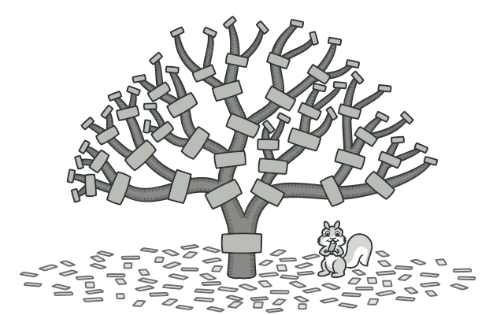
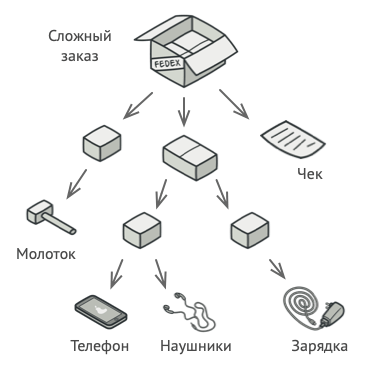
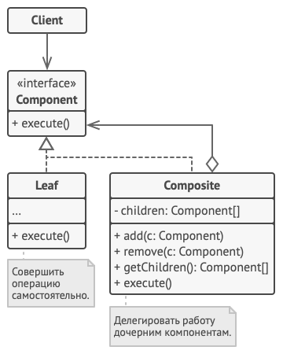

# Компоновщик
Также известен как: Дерево, Composite 

## Источник
[Refactoring GURU: Компоновщик](https://refactoring.guru/ru/design-patterns/composite)

## Суть паттерна

**Компоновщик** — это структурный паттерн проектирования, который позволяет сгруппировать множество объектов в древовидную структуру, а затем работать с ней так, как будто это единичный объект.

## Проблема

Паттерн Компоновщик имеет смысл только тогда, когда основная модель вашей программы может быть структурирована в виде дерева.

Например, есть два объекта: *Продукт* и *Коробка*. *Коробка* может содержать несколько *Продуктов* и других *Коробок* поменьше. Те, в свою очередь, тоже содержат либо *Продукты*, либо *Коробки* и так далее.

Теперь предположим, ваши *Продукты* и *Коробки* могут быть частью заказов. Каждый заказ может содержать как простые *Продукты* без упаковки, так и составные *Коробки*. Ваша задача состоит в том, чтобы узнать цену всего заказа.

Если решать задачу в лоб, то вам потребуется открыть все коробки заказа, перебрать все продукты и посчитать их суммарную стоимость. Но это слишком хлопотно, так как типы коробок и их содержимое могут быть вам неизвестны. Кроме того, наперёд неизвестно и количество уровней вложенности коробок, поэтому перебрать коробки простым циклом не выйдет.

## Решение

Компоновщик предлагает рассматривать *Продукт* и *Коробку* через единый интерфейс с общим методом получения стоимости.

*Продукт* просто вернёт свою цену. *Коробка* спросит цену каждого предмета внутри себя и вернёт сумму результатов. Если одним из внутренних предметов окажется коробка поменьше, она тоже будет перебирать своё содержимое, и так далее, пока не будут посчитаны все составные части.

Для вас, клиента, главное, что теперь не нужно ничего знать о структуре заказов. Вы вызываете метод получения цены, он возвращает цифру, а вы не тонете в горах картона и скотча.

## Структура

1. **Компонент** определяет общий интерфейс для простых и составных компонентов дерева.
2. **Лист** — это простой компонент дерева, не имеющий ответвлений. Из-за того, что им некому больше передавать выполнение, классы листьев будут содержать большую часть полезного кода.
3. **Контейнер** (или *композит*) — это составной компонент дерева. Он содержит набор дочерних компонентов, но ничего не знает об их типах. Это могут быть как простые компоненты-листья, так и другие компоненты-контейнеры. Но это не является проблемой, если все дочерние компоненты следуют единому интерфейсу. Методы контейнера переадресуют основную работу своим дочерним компонентам, хотя и могут добавлять что-то своё к результату.
4. **Клиент** работает с деревом через общий интерфейс компонентов. Благодаря этому, клиенту не важно, что перед ним находится — простой или составной компонент дерева.

## Применимость

* **Когда вам нужно представить древовидную структуру объектов.**
    > Паттерн Компоновщик предлагает хранить в составных объектах ссылки на другие простые или составные объекты. Те, в свою очередь, тоже могут хранить свои вложенные объекты и так далее. В итоге вы можете строить сложную древовидную структуру данных, используя всего две основные разновидности объектов.
* **Когда клиенты должны единообразно трактовать простые и составные объекты.**
    > Благодаря тому, что простые и составные объекты реализуют общий интерфейс, клиенту безразлично, с каким именно объектом ему предстоит работать.

## Шаги реализации

1. Убедитесь, что вашу бизнес-логику можно представить как древовидную структуру. Попытайтесь разбить её на простые компоненты и контейнеры. Помните, что контейнеры могут содержать как простые компоненты, так и другие вложенные контейнеры.
2. Создайте общий интерфейс компонентов, который объединит операции контейнеров и простых компонентов дерева. Интерфейс будет удачным, если вы сможете использовать его, чтобы взаимозаменять простые и составные компоненты без потери смысла.
3. Создайте класс компонентов-листьев, не имеющих дальнейших ответвлений. Имейте в виду, что программа может содержать несколько таких классов.
4. Создайте класс компонентов-контейнеров и добавьте в него массив для хранения ссылок на вложенные компоненты. Этот массив должен быть способен содержать как простые, так и составные компоненты, поэтому убедитесь, что он объявлен с типом интерфейса компонентов.

Реализуйте в контейнере методы интерфейса компонентов, помня о том, что контейнеры должны делегировать основную работу своим дочерним компонентам.
5. Добавьте операции добавления и удаления дочерних компонентов в класс контейнеров.

Имейте в виду, что методы добавления/удаления дочерних компонентов можно поместить и в интерфейс компонентов. Да, это нарушит *принцип разделения интерфейса*, так как реализации методов будут пустыми в компонентах-листьях. Но зато все компоненты дерева станут действительно одинаковыми для клиента.

## Преимущества и недостатки

<table>
  <thead>
    <tr>
      <th>Преимущества</th>
      <th>Недостатки</th>
    </tr>
  </thead>
  <tbody >
    <tr>
      <td>Упрощает архитектуру клиента при работе со сложным деревом компонентов.</td>
      <td rowspan="2">Создаёт слишком общий дизайн классов.</td>
    </tr>
    <tr>
      <td>Облегчает добавление новых видов компонентов.</td>
    </tr>
  </tbody>
</table>

## Запуск примера

### Сборка

    * mvn clean package

### Запуск

    * java -Dfile.encoding=UTF-8 -classpath target/classes ru.koylubaevnt.patterns.structural.composite.Demo

