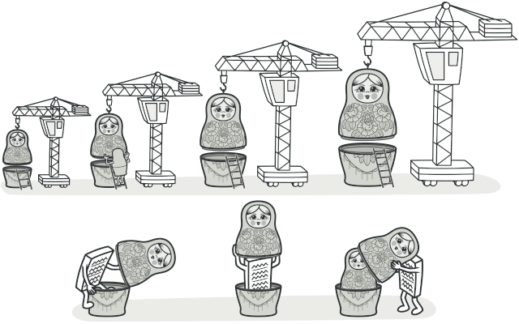
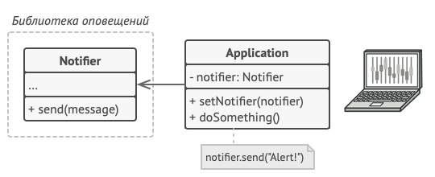
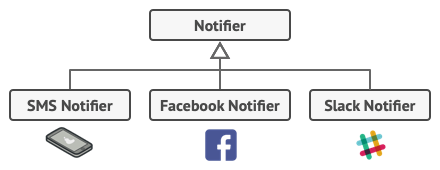
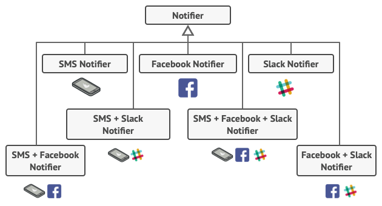
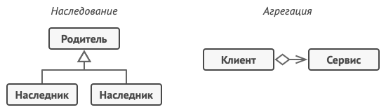
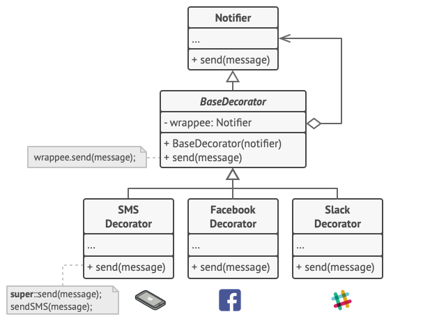
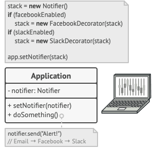
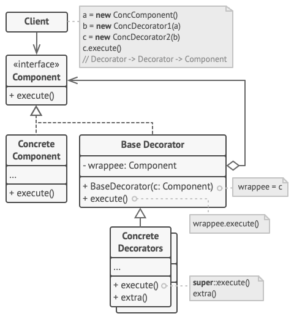

# Декоратор
Также известен как: Wrapper, Обёртка, Decorator 

## Источник
[Refactoring GURU: Декоратор](https://refactoring.guru/ru/design-patterns/decorator)

## Суть паттерна

Декоратор — это структурный паттерн проектирования, который позволяет динамически добавлять объектам новую функциональность, оборачивая их в полезные «обёртки».

## Проблема

Вы работаете над библиотекой оповещений, которую можно подключать к разнообразным программам, чтобы получать уведомления о важных событиях.

Основой библиотеки является класс *Notifier* с методом *send*, который принимает на вход строку-сообщение и высылает её всем администраторам по электронной почте. Сторонняя программа должна создать и настроить этот объект, указав кому отправлять оповещения, а затем использовать его каждый раз, когда что-то случается.

В какой-то момент стало понятно, что одних email-оповещений пользователям мало. Некоторые из них хотели бы получать извещения о критических проблемах через SMS. Другие хотели бы получать их в виде сообщений Facebook. Корпоративные пользователи хотели бы видеть сообщения в Slack.

Сначала вы добавили каждый из этих типов оповещений в программу, унаследовав их от базового класса *Notifier*. Теперь пользователь выбирал один из типов оповещений, который и использовался в дальнейшем.

Но затем кто-то резонно спросил, почему нельзя выбрать несколько типов оповещений сразу? Ведь если вдруг в вашем доме начался пожар, вы бы хотели получить оповещения по всем каналам, не так ли?

Вы попытались реализовать все возможные комбинации подклассов оповещений. Но после того как вы добавили первый десяток классов, стало ясно, что такой подход невероятно раздувает код программы.

Итак, нужен какой-то другой способ комбинирования поведения объектов, который не приводит к взрыву количества подклассов.

## Решение

Наследование — это первое, что приходит в голову многим программистам, когда нужно расширить какое-то существующее поведение. Но механизм наследования имеет несколько досадных проблем.

* Он **статичен**. Вы не можете изменить поведение существующего объекта. Для этого вам надо создать новый объект, выбрав другой подкласс.
* Он **не разрешает наследовать поведение нескольких классов одновременно**. Из-за этого вам приходится создавать множество подклассов-комбинаций для получения совмещённого поведения.

Одним из способов обойти эти проблемы является замена наследования *агрегацией* либо *композицией*. Это когда один объект содержит ссылку на другой и делегирует ему работу, вместо того чтобы самому наследовать его поведение. Как раз на этом принципе построен паттерн *Декоратор*.

Декоратор имеет альтернативное название — *обёртка*. Оно более точно описывает суть паттерна: вы помещаете целевой объект в другой объект-обёртку, который запускает базовое поведение объекта, а затем добавляет к результату что-то своё.

Оба объекта имеют общий интерфейс, поэтому для пользователя нет никакой разницы, с каким объектом работать — чистым или обёрнутым. Вы можете использовать несколько разных обёрток одновременно — результат будет иметь объединённое поведение всех обёрток сразу.

В примере с оповещениями мы оставим в базовом классе простую отправку по электронной почте, а расширенные способы отправки сделаем декораторами.

Сторонняя программа, выступающая клиентом, во время первичной настройки будет заворачивать объект оповещений в те обёртки, которые соответствуют желаемому способу оповещения.

Последняя обёртка в списке и будет тем объектом, с которым клиент будет работать в остальное время. Для остального клиентского кода, по сути, ничего не изменится, ведь все обёртки имеют точно такой же интерфейс, что и базовый класс оповещений.

Таким же образом можно изменять не только способ доставки оповещений, но и форматирование, список адресатов и так далее. К тому же клиент может «дообернуть» объект любыми другими обёртками, когда ему захочется.

## Структура

1. **Компонент** задаёт общий интерфейс обёрток и оборачиваемых объектов.
2. **Конкретный компонент** определяет класс оборачиваемых объектов. Он содержит какое-то базовое поведение, которое потом изменяют декораторы.
3. **Базовый декоратор** хранит ссылку на вложенный объект-компонент. Им может быть как конкретный компонент, так и один из конкретных декораторов. Базовый декоратор делегирует все свои операции вложенному объекту. Дополнительное поведение будет жить в конкретных декораторах.
4. **Конкретные декораторы** — это различные вариации декораторов, которые содержат добавочное поведение. Оно выполняется до или после вызова аналогичного поведения обёрнутого объекта.
5. **Клиент** может оборачивать простые компоненты и декораторы в другие декораторы, работая со всеми объектами через общий интерфейс компонентов.

## Применимость

* **Когда вам нужно добавлять обязанности объектам на лету, незаметно для кода, который их использует.**
    > Объекты помещают в обёртки, имеющие дополнительные поведения. Обёртки и сами объекты имеют одинаковый интерфейс, поэтому клиентам без разницы, с чем работать — с обычным объектом данных или с обёрнутым.
* **Когда нельзя расширить обязанности объекта с помощью наследования.**
    > Во многих языках программирования есть ключевое слово *final*, которое может заблокировать наследование класса. Расширить такие классы можно только с помощью Декоратора.

## Шаги реализации

1. Убедитесь, что в вашей задаче есть один основной компонент и несколько опциональных дополнений или надстроек над ним.
2. Создайте интерфейс компонента, который описывал бы общие методы как для основного компонента, так и для его дополнений.
3. Создайте класс конкретного компонента и поместите в него основную бизнес-логику.
4. Создайте базовый класс декораторов. Он должен иметь поле для хранения ссылки на вложенный объект-компонент. Все методы базового декоратора должны делегировать действие вложенному объекту.
5. И конкретный компонент, и базовый декоратор должны следовать одному и тому же интерфейсу компонента.
6. Теперь создайте классы конкретных декораторов, наследуя их от базового декоратора. Конкретный декоратор должен выполнять свою добавочную функцию, а затем (или перед этим) вызывать эту же операцию обёрнутого объекта.
7. Клиент берёт на себя ответственность за конфигурацию и порядок обёртывания объектов.

## Преимущества и недостатки

<table>
  <thead>
    <tr>
      <th>Преимущества</th>
      <th>Недостатки</th>
    </tr>
  </thead>
  <tbody >
    <tr>
      <td>Большая гибкость, чем у наследования.</td>
      <td rowspan="2">Трудно конфигурировать многократно обёрнутые объекты.</td>
    </tr>
    <tr>
      <td>Позволяет добавлять обязанности на лету.</td>
    </tr>
    <tr>
      <td>Можно добавлять несколько новых обязанностей сразу.</td>
      <td rowspan="2">Обилие крошечных классов.</td>
    </tr>
    <tr>
      <td>Позволяет иметь несколько мелких объектов вместо одного объекта на все случаи жизни.</td>
    </tr>
  </tbody>
</table>

## Запуск примера

### Сборка

    * mvn clean package

### Запуск

    * java -Dfile.encoding=UTF-8 -classpath target/classes ru.koylubaevnt.patterns.structural.decorator.Demo
