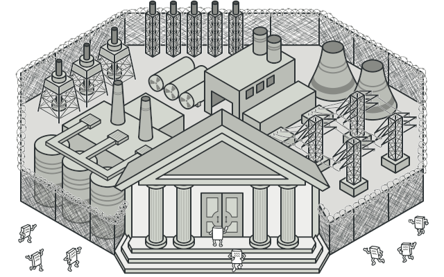
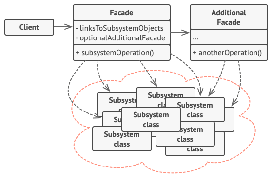

# Фасад
Также известен как: Facade

## Источник
[Refactoring GURU: Фасад](https://refactoring.guru/ru/design-patterns/facade)

## Суть паттерна

**Фасад** — это структурный паттерн проектирования, который предоставляет простой интерфейс к сложной системе классов, библиотеке или фреймворку.

## Проблема

Вашему коду приходится работать с большим количеством объектов некой сложной библиотеки или фреймворка. Вы должны самостоятельно инициализировать эти объекты, следить за правильным порядком зависимостей и так далее.

В результате бизнес-логика ваших классов тесно переплетается с деталями реализации сторонних классов. Такой код довольно сложно понимать и поддерживать.

## Решение

Фасад — это простой интерфейс для работы со сложной подсистемой, содержащей множество классов. Фасад может иметь урезанный интерфейс, не имеющий 100% функциональности, которой можно достичь, используя сложную подсистему напрямую. Но он предоставляет именно те фичи, которые нужны клиенту, и скрывает все остальные.

Фасад полезен, если вы используете какую-то сложную библиотеку со множеством подвижных частей, но вам нужна только часть её возможностей.

К примеру, программа, заливающая видео котиков в социальные сети, может использовать профессиональную библиотеку сжатия видео. Но все, что нужно клиентскому коду этой программы — простой метод encode(filename, format). Создав класс с таким методом, вы реализуете свой первый фасад.

## Структура

1. **Фасад** предоставляет быстрый доступ к определённой функциональности подсистемы. Он «знает», каким классам нужно переадресовать запрос, и какие данные для этого нужны.
2. **Дополнительный фасад** можно ввести, чтобы не «захламлять» единственный фасад разнородной функциональностью. Он может использоваться как клиентом, так и другими фасадами.
3. **Сложная подсистема** состоит из множества разнообразных классов. Для того, чтобы заставить их что-то делать, нужно знать подробности устройства подсистемы, порядок инициализации объектов и так далее.

Классы подсистемы не знают о существовании фасада и работают друг с другом напрямую.
4. **Клиент** использует фасад вместо прямой работы с объектами сложной подсистемы.

## Применимость

* **Когда вам нужно представить простой или урезанный интерфейс к сложной подсистеме.**
    > Часто подсистемы усложняются по мере развития программы. Применение большинства паттернов приводит к появлению меньших классов, но в бóльшем количестве. Такую подсистему проще повторно использовать, настраивая её каждый раз под конкретные нужды, но вместе с тем, применять подсистему без настройки становится труднее. Фасад предлагает определённый вид системы по умолчанию, устраивающий большинство клиентов.

* **Когда вы хотите разложить подсистему на отдельные слои.**
    > Используйте фасады для определения точек входа на каждый уровень подсистемы. Если подсистемы зависят друг от друга, то зависимость можно упростить, разрешив подсистемам обмениваться информацией только через фасады.

      Например, возьмём ту же сложную систему видеоконвертации. Вы хотите разбить её на слои работы с аудио и видео. Для каждой из этих частей можно попытаться создать фасад и заставить классы аудио и видео обработки общаться друг с другом через эти фасады, а не напрямую.

## Шаги реализации

1. Определите, можно ли создать более простой интерфейс, чем тот, который предоставляет сложная подсистема. Вы на правильном пути, если этот интерфейс избавит клиента от необходимости знать о подробностях подсистемы.
2. Создайте класс фасада, реализующий этот интерфейс. Он должен переадресовывать вызовы клиента нужным объектам подсистемы. Фасад должен будет позаботиться о том, чтобы правильно инициализировать объекты подсистемы.
3. Вы получите максимум пользы, если клиент будет работать только с фасадом. В этом случае изменения в подсистеме будут затрагивать только код фасада, а клиентский код останется рабочим.
4. Если ответственность фасада **начинает размываться**, подумайте о введении дополнительных фасадов.

## Преимущества и недостатки

<table>
  <thead>
    <tr>
      <th>Преимущества</th>
      <th>Недостатки</th>
    </tr>
  </thead>
  <tbody >
    <tr>
      <td>Изолирует клиентов от компонентов сложной подсистемы.</td>
      <td>Фасад рискует стать <b>божественным объектом</b>, привязанным ко всем классам программы.</td>
    </tr>
  </tbody>
</table>

## Запуск примера

### Сборка

    * mvn clean package

### Запуск

    * java -Dfile.encoding=UTF-8 -classpath target/classes ru.koylubaevnt.patterns.structural.facade.Demo

