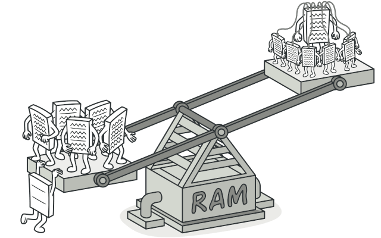
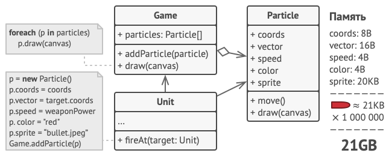
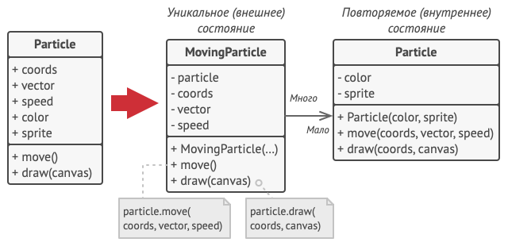
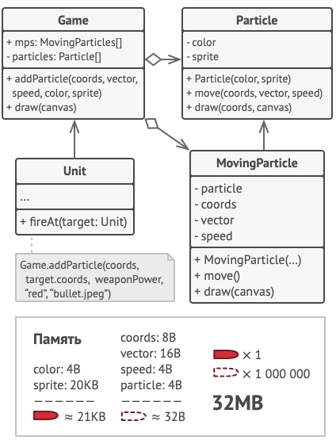
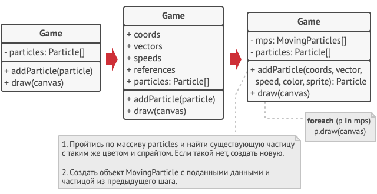
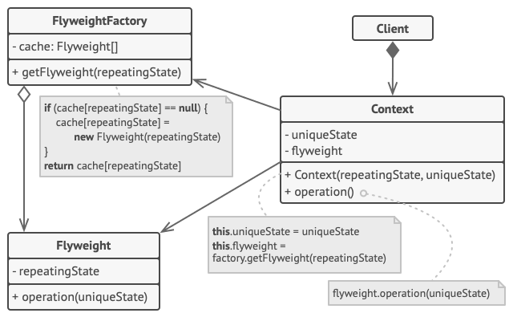

# Легковес
Также известен как: Приспособленец, Кэш, Flyweight

## Источник

[Refactoring GURU: Легковес](https://refactoring.guru/ru/design-patterns/flyweight)

## Суть паттерна

**Легковес** — это структурный паттерн проектирования, который позволяет вместить бóльшее количество объектов в отведённую оперативную память. Легковес экономит память, разделяя общее состояние объектов между собой, вместо хранения одинаковых данных в каждом объекте.

## Проблема

На досуге вы решили написать небольшую игру, в которой игроки перемещаются по карте и стреляют друг в друга. Фишкой игры должна была стать реалистичная система частиц. Пули, снаряды, осколки от взрывов — всё это должно красиво летать и радовать взгляд.

Игра отлично работала на вашем мощном компьютере. Однако ваш друг сообщил, что игра начинает тормозить и вылетает через несколько минут после запуска. Покопавшись в логах, вы обнаружили, что игра вылетает из-за недостатка оперативной памяти. У вашего друга компьютер значительно менее «прокачанный», поэтому проблема у него и проявляется так быстро.

И действительно, каждая частица представлена собственным объектом, имеющим множество данных. В определённый момент, когда побоище на экране достигает кульминации, новые объекты частиц уже не вмещаются в оперативную память компьютера, и программа вылетает.

## Решение

Если внимательно посмотреть на класс частиц, то можно заметить, что цвет и спрайт занимают больше всего памяти. Более того, они хранятся в каждом объекте, хотя фактически их значения одинаковы для большинства частиц.

Остальное состояние объектов — координаты, вектор движения и скорость — отличаются для всех частиц. Таким образом, эти поля можно рассматривать как контекст, в котором частица используется. А цвет и спрайт — это данные, не изменяющиеся во времени.

Неизменяемые данные объекта принято называть «внутренним состоянием». Все остальные данные — это «внешнее состояние».

Паттерн Легковес предлагает не хранить в классе внешнее состояние, а передавать его в те или иные методы через параметры. Таким образом, одни и те же объекты можно будет повторно использовать в различных контекстах. Но главное — понадобится гораздо меньше объектов, ведь теперь они будут отличаться только внутренним состоянием, а оно имеет не так много вариаций.

В нашем примере с частицами достаточно будет оставить всего три объекта с отличающимися спрайтами и цветом — для пуль, снарядов и осколков. Несложно догадаться, что такие облегчённые объекты называют *легковéсами*.

### Хранилище внешнего состояния

Но куда переедет внешнее состояние? Ведь кто-то должен его хранить. Чаще всего, его перемещают в контейнер, который управлял объектами до применения паттерна.

В нашем случае это был главный объект игры. Вы могли бы добавить в его класс поля-массивы для хранения координат, векторов и скоростей частиц. Кроме этого, понадобится ещё один массив для хранения ссылок на объекты-легковесы, соответствующие той или иной частице.

Но более элегантным решением было бы создать дополнительный класс-контекст, который бы связывал внешнее состояние с тем или иным легковесом. Это позволит обойтись только одним полем-массивом в классе контейнера.

«Но погодите-ка, нам потребуется столько же этих объектов, сколько было в самом начале!», — скажете вы и будете правы! Но дело в том, что объекты-контексты занимают намного меньше места, чем первоначальные. Ведь самые тяжёлые поля остались в легковесах (простите за каламбур), и сейчас мы будем ссылаться на эти объекты из контекстов, вместо того, чтобы повторно хранить дублирующееся состояние.

### Неизменяемость Легковесов

Так как объекты легковесов будут использованы в разных контекстах, вы должны быть уверены в том, что их состояние невозможно изменить после создания. Всё внутреннее состояние легковес должен получать через параметры конструктора. Он не должен иметь сеттеров и публичных полей.

### Фабрика Легковесов

Для удобства работы с легковесами и контекстами можно создать фабричный метод, принимающий в параметрах всё внутреннее (а иногда и внешнее) состояние желаемого объекта.

Главная польза от этого метода в том, чтобы искать уже созданные легковесы с таким же внутренним состоянием, что и требуемое. Если легковес находится, его можно повторно использовать. Если нет — просто создаём новый. Обычно этот метод добавляют в контейнер легковесов либо создают отдельный класс-фабрику. Его даже можно сделать статическим и поместить в класс легковесов.

## Структура

1. Вы всегда должны помнить о том, что Легковес применяется в программе, имеющей громадное количество одинаковых объектов. Этих объектов должно быть так много, чтобы они не помещались в доступную оперативную память без ухищрений. Паттерн разделяет данные этих объектов на две части — легковесы и контексты.
2. **Легковес** содержит состояние, которое повторялось во множестве первоначальных объектов. Один и тот же легковес можно использовать в связке со множеством контекстов. Состояние, которое хранится здесь, называется *внутренним*, а то, которое он получает извне — *внешним*.
3. **Контекст** содержит «внешнюю» часть состояния, уникальную для каждого объекта. Контекст связан с одним из объектов-легковесов, хранящих оставшееся состояние.
4. Поведение оригинального объекта чаще всего оставляют в Легковесе, передавая значения контекста через параметры методов. Тем не менее, поведение можно поместить и в контекст, используя легковес как объект данных.
5. **Клиент** вычисляет или хранит контекст, то есть внешнее состояние легковесов. Для клиента легковесы выглядят как шаблонные объекты, которые можно настроить во время использования, передав контекст через параметры.
6. **Фабрика легковесов** управляет созданием и повторным использованием легковесов. Фабрика получает запросы, в которых указано желаемое состояние легковеса. Если легковес с таким состоянием уже создан, фабрика сразу его возвращает, а если нет — создаёт новый объект.

##  Применимость

* **Когда не хватает оперативной памяти для поддержки всех нужных объектов.**
    > Эффективность паттерна Легковес во многом зависит от того, как и где он используется. Применяйте этот паттерн, когда выполнены все перечисленные условия: 
      * в приложении используется большое число объектов; 
      * из-за этого высоки расходы оперативной памяти; 
      * большую часть состояния объектов можно вынести за пределы их классов; 
      * большие группы объектов можно заменить относительно небольшим количеством разделяемых объектов, поскольку внешнее состояние вынесено.

## Шаги реализации

1. Разделите поля класса, который станет легковесом, на две части:
    * внутреннее состояние: значения этих полей одинаковы для большого числа объектов;
    * внешнее состояние (контекст): значения полей уникальны для каждого объекта.
2. Оставьте поля внутреннего состояния в классе, но убедитесь, что их значения неизменяемы. Эти поля должны инициализироваться только через конструктор.
3. Превратите поля внешнего состояния в параметры методов, где эти поля использовались. Затем удалите поля из класса.
4. Создайте фабрику, которая будет кешировать и повторно отдавать уже созданные объекты. Клиент должен запрашивать из этой фабрики легковеса с определённым внутренним состоянием, а не создавать его напрямую.
5. Клиент должен хранить или вычислять значения внешнего состояния (контекст) и передавать его в методы объекта легковеса.

## Преимущества и недостатки

<table>
  <thead>
    <tr>
      <th>Преимущества</th>
      <th>Недостатки</th>
    </tr>
  </thead>
  <tbody >
    <tr>
      <td rowspan="2">Экономит оперативную память.</td>
      <td>Расходует процессорное время на поиск/вычисление контекста.</td>
    </tr><tr>
      <td>Усложняет код программы из-за введения множества дополнительных классов.</td>
    </tr>
  </tbody>
</table>

## Запуск примера

### Сборка

    * mvn clean package

### Запуск

    * java -Dfile.encoding=UTF-8 -classpath target/classes ru.koylubaevnt.patterns.structural.flyweight.Demo
